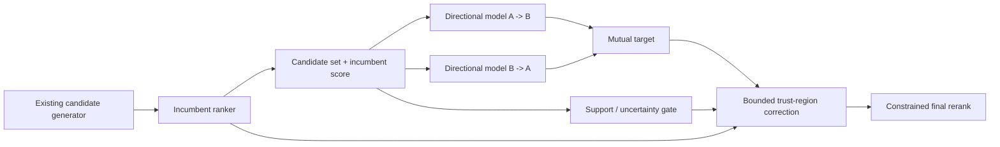

# Domamutzer

**A reciprocal people-discovery reranker for introductions that need to make sense in both directions.**

Domamutzer is a research-stage second-stage ranking layer. It does **not** replace a platform's candidate generator or incumbent recommender. Instead, it asks a narrower question:

> Among candidates the platform is already willing to show, which introduction has the strongest evidence of being valuable for **both** people?

The current architecture keeps the incumbent score as a prior, estimates directional utility in both directions, and only makes a bounded reranking intervention when evidence is strong enough.

## At a glance

| Property | Domamutzer approach |
|---|---|
| Two-sided objective | Model `A -> B` and `B -> A` separately |
| Incumbent preservation | Existing platform score stays the prior |
| Weak evidence | Intervention shrinks toward zero |
| Rank safety | Bounded log-odds shift + local reranking window |
| Historical replay | Supports IPS / SNIPS / doubly-robust evaluation concepts |
| Deployment idea | Second-stage reranker over an existing candidate set |

## Why reciprocal ranking?

A person is not an ordinary recommendation item. A high one-sided score can still produce a poor introduction if the other direction is weak.

Domamutzer keeps the directional predictions separate:

- `pAB = P(A values / accepts B | context)`
- `pBA = P(B values / accepts A | reversed context)`

The public reference uses harmonic fusion as its default mutual target:

$$
 m(A,B)=\frac{2p_{AB}p_{BA}}{p_{AB}+p_{BA}}.
$$

A low value in either direction therefore pulls the mutual score down.

## Baseline-preserving policy

Let `s0` be the incumbent platform score and `m` the mutual target. Domamutzer applies a support-gated bounded correction in log-odds space:

$$
\Delta=\mathrm{clip}(\mathrm{logit}(m)-\mathrm{logit}(s_0),-\delta,+\delta)
$$

$$
s=\sigma(\mathrm{logit}(s_0)+g\Delta), \qquad g\in[0,1].
$$

When support is absent (`g = 0`), the result is **exactly the incumbent score**. The reranker is therefore allowed to abstain rather than force a new ranking signal into every case.

## Architecture



## Run the public reference

No external packages are required.

```bash
python examples/quickstart.py
python -m unittest discover -s reference -v
```

The runnable public policy is intentionally small enough to inspect directly:

[`reference/domamutzer_reference.py`](reference/domamutzer_reference.py)

Example behavior:

```text
candidate-A base=0.700 mutual=0.849 final=0.812
candidate-C base=0.660 mutual=0.755 final=0.744
candidate-B base=0.680 mutual=0.462 final=0.535
```

Candidate B has a reasonable incumbent score but asymmetric directional utility, so the reciprocal layer pushes it down.

## What would a real platform evaluation look like?

Domamutzer is intended to be tested **on top of** an existing ranking stack, using the same eligible candidate pool.

A useful pseudonymous replay row would contain fields such as:

```text
viewer_id
candidate_id
incumbent_score
logging_propensity          # if available
permitted pair/context features
impression
profile_open
connect_request
reciprocal_accept
reply
D7 continuation
hide
block
report
```

The key comparison is not "can Domamutzer predict an old friendship edge?" It is whether the reciprocal reranker improves a predeclared two-sided outcome while respecting negative-feedback guardrails.

See [`docs/BUYER_REPLAY_PROTOCOL.md`](docs/BUYER_REPLAY_PROTOCOL.md).

## Evidence and limits

Earlier versions were deliberately tested on external public social-network proxies:

| Proxy | Result | What it taught us |
|---|---:|---|
| GEMSEC Deezer | AMBER | Small top-K signal, but uncertainty remained |
| GitHub social holdout | RED | A fixed symmetric feature family did not generalize |
| Twitch 6-network holdout | RED | The same proxy formulation was not reliably portable |

Those results are retained rather than hidden because they changed the architecture. The current directional, baseline-preserving policy was designed **after** those experiments, so these opened holdouts are not reused to claim v4 superiority.

Public social-link datasets do not contain the directional recommendation-exposure and outcome labels needed to establish production lift. This repository therefore does **not** claim to outperform Meta, TikTok, Snap, or another production recommender.

Frozen reports: [`evidence/`](evidence/)

## Public vs. private

This repository publishes:

- the policy mathematics,
- a runnable reference implementation,
- the evaluation history,
- and the proposed replay protocol.

Private training, ingestion, serving, security, feature-derivation, and production integration code are intentionally excluded.

## Repository map

```text
reference/                     runnable policy reference
examples/                      minimal executable example
docs/ALGORITHM.md              public algorithm specification
docs/BUYER_REPLAY_PROTOCOL.md  platform replay protocol
evidence/                      frozen external proxy evidence
```

## Status

**Evaluation-stage research prototype.** The next decision-grade experiment is a buyer-controlled historical replay or shadow evaluation using directional platform outcomes.

## About

Built independently by **Dorukan Uyar**, a physics student working on ranking and algorithmic modeling. I am interested in technical feedback, research discussion, and evaluation opportunities around reciprocal people discovery.

Contact through the GitHub profile associated with this repository.
