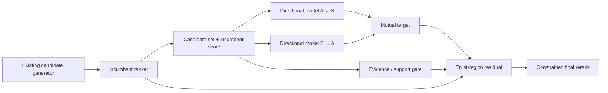

# Domamutzer

### Reciprocal people discovery without throwing away the incumbent ranker

Most social discovery systems are good at estimating **who you may already know**. Domamutzer explores a neighboring question:

> among candidates a platform is already willing to show, which introduction has stronger evidence of being valuable **in both directions**?

Domamutzer is an evaluation-stage reciprocal reranking architecture. It does **not** claim to beat Meta, TikTok, Snap, or any production recommender on public proxy data. Its purpose is to make the next experiment—the buyer-controlled directional replay—technically concrete, conservative, and auditable.

## Core idea



The system intentionally keeps the incumbent score as a prior. When Domamutzer has weak support, it stays near—or exactly at—the incumbent. When both directional evidence and support are strong, it can make a bounded correction.

## The v4 policy

Let:

- `s0(A,B)` be the incumbent platform score,
- `pAB = P(A values/accepts B)`,
- `pBA = P(B values/accepts A)`.

A mutual target can be formed with harmonic fusion:

$$m(A,B)=\frac{2p_{AB}p_{BA}}{p_{AB}+p_{BA}}.$$

Domamutzer then computes an intervention gate `g ∈ [0,1]` from pair support and applies a bounded log-odds move:

$$\Delta=\mathrm{clip}(\mathrm{logit}(m)-\mathrm{logit}(s_0),-\delta,+\delta)$$

$$s=\sigma(\mathrm{logit}(s_0)+g\Delta).$$

So `g=0` is an exact incumbent fallback, and `δ` limits how aggressively the reranker can intervene.

See [`docs/ALGORITHM.md`](docs/ALGORITHM.md) for the public specification.

## Run the public reference implementation

No external packages are required.

```bash
python examples/quickstart.py
python -m unittest discover -s reference -v
```

The runnable reference is in [`reference/domamutzer_reference.py`](reference/domamutzer_reference.py). It demonstrates reciprocal fusion, support gating, trust-region blending, and constrained window reranking. Private ingestion, feature derivation, training, security, and production-serving code are not public.

## Evidence history

Earlier Domamutzer versions were tested on three families of public social-network proxies. The negative results are retained because they changed the architecture.

| Evidence | Gate | Result |
|---|---|---|
| GEMSEC Deezer | AMBER | small mean top-K gains; only Hungary had a clearly positive CI |
| GitHub social network | RED | fixed added-feature model failed the fresh holdout |
| Twitch, 6 networks | RED | macro NDCG@10 delta `-0.000828`; 2/6 networks positive |

Those datasets contain historical links and attributes, **not directional recommendation exposures/outcomes**. They cannot answer the actual product question: does showing A to B create a mutually valuable connection?

The frozen evidence is under [`evidence/`](evidence/), with interpretation in [`docs/EVIDENCE_LEDGER.md`](docs/EVIDENCE_LEDGER.md).

## What changed because of the failures

The project moved away from “add reciprocal/rarity features and hope they generalize.” The current architecture instead uses:

- directional A→B and B→A outcome models,
- mutual fusion rather than one-sided relevance,
- baseline-first intervention,
- evidence/support gating,
- bounded log-odds movement,
- optional incumbent-window constrained reranking,
- IPS / SNIPS / doubly-robust evaluation for biased historical logs,
- explicit hide/block/report safety guardrails.

This is a **safer evaluation architecture**, not a retroactive claim that the public RED benchmarks became positive.

## Buyer-controlled evaluation

The decision-grade test is a replay or shadow evaluation on a fixed candidate pool with pseudonymous historical data:

```text
viewer_id
candidate_id
incumbent_score
logging_propensity        # if available / estimated and documented
permitted pair features
impression
profile_open
connect_request
reciprocal_accept
reply
D7 continuation
hide
block
report
```

Compare incumbent vs Domamutzer under the same candidate pool. Predeclare primary metrics and safety guardrails before opening the result. See [`docs/BUYER_REPLAY_PROTOCOL.md`](docs/BUYER_REPLAY_PROTOCOL.md).

## Repository map

```text
reference/                     runnable public policy reference
examples/                      tiny executable example
evidence/                      frozen public proxy results
docs/ALGORITHM.md              equations and policy semantics
docs/EVIDENCE_LEDGER.md        what existing experiments prove
docs/BUYER_REPLAY_PROTOCOL.md  decision-grade next evaluation
```

## Research context

Domamutzer is informed by reciprocal recommender systems, where both parties' preferences jointly determine success, and by counterfactual/off-policy evaluation for logged recommendation data.

- Yang et al., *Revisiting Reciprocal Recommender Systems: Metrics, Formulation, and Method* (2024): https://arxiv.org/abs/2408.09748
- Kawamura et al., *Counterfactual Reciprocal Recommender Systems for User-to-User Matching* (2025): https://arxiv.org/abs/2508.01867
- Palomares et al., *Reciprocal Recommender Systems: Analysis of State-of-Art Literature...* (2020): https://arxiv.org/abs/2007.16120

## Status

**Research/evaluation stage.** The private v4 engine is built for technical replay, not advertised as production-proven. The next meaningful evidence is directional platform data, not another round of tuning on already-open public holdouts.

## Contact

For technical evaluation, use the contact information on the GitHub profile associated with this repository.
