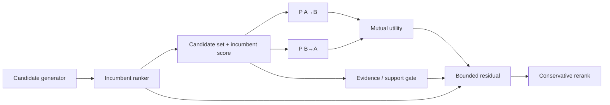

# Domamutzer

**Reciprocal people-discovery reranking for social platforms.**

Domamutzer studies a question that is different from classic *People You May Know* systems:

> Among candidates a platform is already willing to show, which introduction has the strongest evidence of being valuable **for both people**?

It is designed as a conservative reranking layer on top of an existing candidate generator and incumbent ranker. The public repository contains a dependency-free reference implementation, the core equations, and the external evidence history. Production ingestion, private feature derivation, training infrastructure, security, and serving code are not public.

## Why reciprocal ranking?

A one-sided people recommender can assign a high score to `A -> B` even when `B -> A` is weak. For introductions, that asymmetry matters. Domamutzer models the two directions separately and combines them only after both have been estimated.



## Core policy

Let `s0` be the incumbent platform score, and let `pAB` and `pBA` be directional probabilities. A reciprocal target can be formed with harmonic fusion:

$$
 m(A,B)=\frac{2p_{AB}p_{BA}}{p_{AB}+p_{BA}}.
$$

Domamutzer does **not** replace the incumbent score blindly. It applies a support-gated, bounded correction in log-odds space:

$$
\Delta=\operatorname{clip}\big(\operatorname{logit}(m)-\operatorname{logit}(s_0),-\delta,+\delta\big)
$$

$$
s=\sigma\big(\operatorname{logit}(s_0)+g\Delta\big), \qquad g\in[0,1].
$$

When support is weak (`g = 0`), the output is exactly the incumbent score. `δ` is a trust-region bound that limits how aggressively the reranker can move a candidate.

More detail: [`docs/ALGORITHM.md`](docs/ALGORITHM.md).

## Run it in 30 seconds

No third-party packages are required.

```bash
python examples/quickstart.py
python -m unittest discover -s reference -v
```

The public policy reference is in [`reference/domamutzer_reference.py`](reference/domamutzer_reference.py).

## What the public benchmarks actually say

Earlier versions were evaluated on historical attributed social-graph proxies. Those experiments were useful, but they did **not** establish production superiority.

| Dataset family | Outcome | What it taught us |
|---|---|---|
| GEMSEC Deezer | Mixed / AMBER | Added features sometimes improved top-K ranking but did not generalize uniformly. |
| GitHub social graph | RED | A fixed added-feature formulation did not beat the matched baseline on a fresh holdout. |
| Twitch, 6 networks | RED | Adaptive pairwise selection still failed to produce consistent cross-network lift. |

These failures motivated the current baseline-first, directional architecture. The historical datasets contain links and attributes, but not the directional recommendation exposures and downstream outcomes required to answer the actual product question.

Full evidence notes: [`docs/EVIDENCE.md`](docs/EVIDENCE.md).

## The next decision-grade experiment

The appropriate next test is a buyer-controlled replay or shadow evaluation on a **fixed candidate pool** using pseudonymous historical recommendation data. Useful labels include:

```text
viewer_id
candidate_id
incumbent_score
logging_propensity      # when available / estimable
impression
profile_open
connect_request
reciprocal_accept
reply
D7 continuation
hide
block
report
```

The private engine supports directional scoring and off-policy evaluation utilities (IPS, SNIPS, and doubly robust estimation). The public evaluation contract is described in [`docs/EVALUATION_PROTOCOL.md`](docs/EVALUATION_PROTOCOL.md).

## Repository structure

```text
reference/                 runnable public policy reference
examples/                  minimal executable example
docs/ALGORITHM.md          equations and policy semantics
docs/EVIDENCE.md           frozen external evidence history
docs/EVALUATION_PROTOCOL.md buyer-controlled replay protocol
.github/workflows/test.yml automatic public-reference test
```

## Scope

Domamutzer is an **evaluation-stage research prototype**, not a claim that a public benchmark has beaten Meta, TikTok, Snap, or another production recommender. Its purpose is to make a controlled reciprocal-ranking experiment concrete, auditable, and low-risk to integrate with an incumbent ranking stack.

## Research context

The design is informed by work on reciprocal recommendation, causal bilateral recommendation, counterfactual evaluation, and two-sided matching markets.

- Yang et al., *Revisiting Reciprocal Recommender Systems: Metrics, Formulation, and Method* (KDD 2024)
- Kawamura et al., *Counterfactual Reciprocal Recommender Systems for User-to-User Matching* (2025)
- Tomita & Yokoyama, *Fair Reciprocal Recommendation in Matching Markets* (RecSys 2024)

## Contact

For technical evaluation, use the contact information on the GitHub profile associated with this repository.
